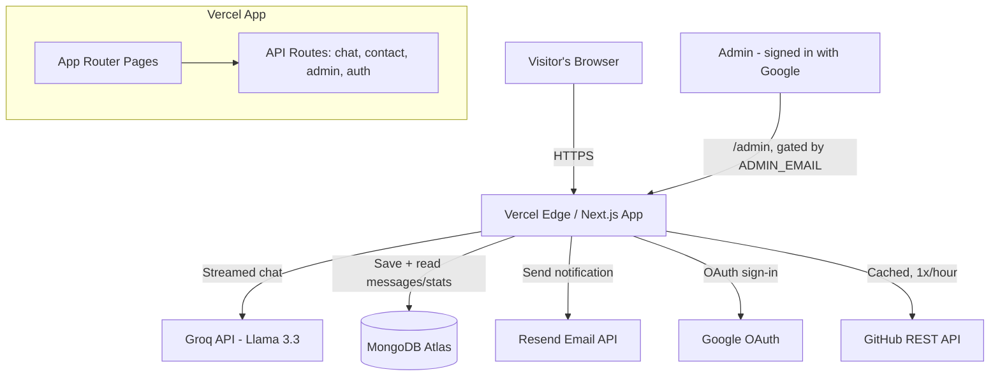

# Rishabh Chaturvedi — Portfolio

An advanced, full-stack placement portfolio built with Next.js (App Router),
featuring a real AI chatbot, live coding-profile stats, Google-authenticated
admin dashboard, and a database-backed contact pipeline.

**Live site:** https://portfolio-starter-eta.vercel.app

## Tech stack

| Layer | Choice |
|---|---|
| Framework | Next.js 14 (App Router) |
| Styling | Tailwind CSS |
| Animation | Framer Motion |
| Auth | NextAuth.js (Google OAuth) |
| Database | MongoDB Atlas |
| AI Chatbot | Groq (Llama 3.3 70B), streamed |
| Email | Resend |
| Analytics | Vercel Web Analytics |
| Deployment | Vercel |
| Testing | Jest + React Testing Library |
| CI | GitHub Actions |

## Features

- Animated hero with a live-typed code snippet and profile photo
- Real bio, education history (with institution logos), and a categorized
  skills section with an interactive radial skills graph
- Live GitHub/LeetCode/HackerRank profile cards, including top starred repos
  pulled live from the GitHub API (server-cached to avoid rate limits)
- An AI chatbot (streaming responses) that answers questions about the
  resume and can explain individual projects in depth on request
- Dark/light mode, a runtime accent-color picker, and a partial
  English/Hindi language switcher
- Command palette (Cmd/Ctrl+K), 3D tilt project cards, custom cursor,
  scroll-reveal animations, and a VS Code-style status bar with scroll
  progress
- A real contact pipeline: Zod-validated submissions save to MongoDB and
  trigger an email notification, with a WhatsApp quick-contact option
- Google sign-in for visitors, with a separate admin-only dashboard
  (`/admin`) to view messages and resume-download analytics
- PWA support (installable, works offline for cached pages)
- SEO: sitemap, robots.txt, Open Graph/Twitter meta, and JSON-LD structured
  data for rich search results
- Security headers, input validation, and a documented environment-variable
  setup for every integration

## Architecture



## Local development

```bash
npm install
cp .env.example .env.local   # then fill in your real values
npm run dev
```

Open [http://localhost:3000](http://localhost:3000).

## Environment variables

See `.env.example` for the full list. You'll need free accounts for:
Groq (chatbot), Google Cloud (OAuth), MongoDB Atlas (database), and Resend
(email notifications).

## Testing

```bash
npm test        # run the Jest test suite
npm run lint    # ESLint
npm run format  # Prettier
```

## Deployment

Deployed on Vercel, auto-deploying on every push to `main` via GitHub
Actions CI (lint + test + build check) and Vercel's own build pipeline.
